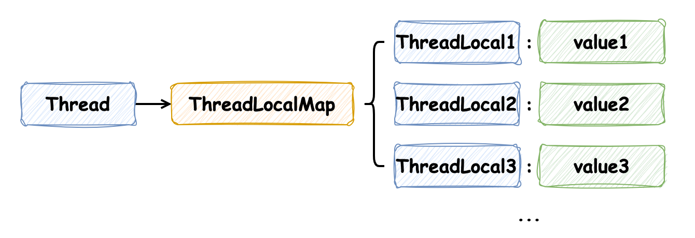

## 《图解Java多线程设计模式》

所谓模式是指“针对某个问题下反复出现的解决方案”，很多时候多种模式会互相作用，形成一个完整的解决方案。

### 基础知识

#### 串行、并行与并发

- 串行：表示多个操作被 **依次处理**，比如把 10 个操作交给一个人处理时，这个人要一个一个地处理
- 并行：表示多个操作被 **同时处理**，比如把 10 个操作交给 10 个人处理，每个人处理一个操作
- 并发：相对于串行和和并行比较抽象，它用于表示“将一个操作分割成多个部分并且允许无序处理”。比如将 6 个操作分成相对独立的两类，这样便能够开始并发处理了，如下图所示为并发处理的串行执行和并行执行：


#### 进程与线程

进程与线程是操作系统中的两个重要概念，**进程是程序的一次执行，是一个独立的运行环境**，而**线程是进程中的一个执行单元，是 CPU 调度的基本单位**。一个进程可以包含多个线程，线程之间共享进程的资源，比如内存空间、文件句柄等。一般情况下，线程的创建和销毁比进程要快，线程之间的切换也比进程要快，因为一般来说进程中管理的上下文信息会多余线程中管理的上下文信息，而进程/线程暂停时要保存执行过程中的上下文信息，再继续执行时需要恢复之前保存的上下文信息，所以一般来说多线程的并发性比多进程要高。

进程与线程的最大的区别就是**内存是否共享**：**进程有独立的内存空间**，一个进程的内存空间不能被其他进程访问，而**线程共享进程的内存空间**（在 Java 中表示为共享实例），一个线程的内存空间可以被其他线程访问。

#### Java 线程状态

Java 线程的状态主要有以下几种：

1. **新建（New）**：线程对象被创建后，就进入了新建状态。如：`Thread t = new Thread()`

2. **就绪（Runnable）**：当调用线程对象的 `start()` 方法（`t.start()`），线程即进入就绪状态。处于就绪状态的线程，只是获取了执行权，但并未被 CPU 选中执行

3. **运行（Running）**：当 CPU 选中就绪状态的线程后，此线程即进入运行状态，开始执行 `run()` 方法中的代码

4. **阻塞（Blocked）**：阻塞状态是线程因为某种原因放弃了 CPU 使用权，也即让出了 CPU，暂时停止运行。直到线程进入就绪状态，才有机会转到运行状态。阻塞的情况分三种：
    - 等待阻塞：运行状态中的线程执行 `wait()` 方法，使线程进入到等待阻塞状态
    - 同步阻塞：线程在获取 `synchronized` 同步锁失败（因为锁被其他线程所占用），它会进入同步阻塞状态
    - 其他阻塞：通过调用线程的 `sleep()` 或 `join()` 或发出了 I/O 请求时，线程会进入到阻塞状态。当 `sleep()` 状态超时、`join()` 等待线程终止或超时、或者 I/O 处理完毕时，线程重新转入就绪状态

5. **死亡（Terminated）**：一个运行状态的线程完成任务或者其他终止条件发生时，该线程切换到终止状态

这些状态对 CPU 的影响主要体现在线程调度上：

- 当线程处于新建、就绪或运行状态时，它是活动的，可以被 CPU 调度执行。在这些状态下，线程会占用 CPU 资源
- 当线程处于阻塞状态时，它是非活动的，不会被 CPU 调度，也不会占用 CPU 资源。线程在此状态下会释放 CPU，让 CPU 可以调度其他线程执行
- 当线程处于死亡状态时，它已经完成生命周期，不会再被 CPU 调度

这种机制允许多个线程在同一颗 CPU 上并发执行。通过将线程置入 **阻塞（Blocked）** 状态，系统可以确保 CPU 资源不会被单个线程独占，从而提高系统的整体性能和响应能力

#### synchronized 关键字

在Java中，`synchronized` 关键字可以用来给对象和方法加锁，需要**注意 synchronized 保护的是什么**。当一个线程访问 `synchronized` 修饰的方法或代码块时，它会自动获取锁，其他线程则必须等待该线程释放锁后才能获取锁来访问被保护的代码段。如果一个对象有两个被 `synchronized` 标记的不同方法，那么这两个方法共享同一个对象锁。因此，如果一个线程正在执行其中一个 `synchronized` 方法，其他线程不能同时执行这两个方法中的任何一个，它们必须等待第一个线程释放锁，这是因为 `synchronized` 关键字在**对象级别**上添加了一个互斥锁（或监视器锁）。当一个线程获取了对象的锁，其他线程无法通过，直到锁被释放。

> 加锁要考虑：保护的是什么？保护的东西是什么维度的？拿分布式锁来举例子，先要确定加这把锁想要保护的是什么？是用户级别的锁吗，如果是的话需要考虑在加锁的key上添加上唯一标识，再进一步，这个用户先后加锁有区别吗？如果有区别，需要用什么来区分呢？时间戳可以吗？等等...

如果多线程同时执行同一个对象的被 `synchronized` 修饰的实例方法和静态方法，多线程是不会被阻塞的，因为实例方法和静态方法分别使用的是对象锁和类锁，它们之间是互不干扰的。还有需要注意的是，当线程想要获取锁而被阻塞时，是没有超时机制的，即使调用 interrupt() 方法也不会中断线程，只有等到获取锁后才能中断线程

- eg: life.fangyuan.juc.common.Synchronized

#### 线程的协作：wait()、notify()、notifyAll()

在 Java 中，线程的协作是通过 `Object` 类的 `wait()`、`notify()` 和 `notifyAll()` 方法实现的。**这三个方法必须在 synchronized 修饰的方法或代码块中调用**，也就是说，调用这些方法的线程必须持有锁，否则会抛出 `IllegalMonitorStateException` 异常

- obj.wait(): 是将当前线程放入 obj 对象的等待队列，同时释放锁，让其他线程可以获取锁并执行
- obj.notify(): 是唤醒 obj 对象的等待队列中的一个线程，如果有多个线程在等待队列中，只会唤醒其中一个
- obj.notifyAll(): 是唤醒 obj 对象的等待队列中的所有线程

与其说这三个方法是针对线程的操作，倒不如说是针对实例的等待队列的操作，**并且是持有哪个对象的锁才能进入哪个对象的等待队列**，当线程进入等待队列而停止执行时，并**不会浪费 Java 虚拟机的执行时间**。而且一般来说，使用 notifyAll() 方法的代码更加健壮，因为 notify() 方法只会唤醒一个线程，如果唤醒的是一个不应该被唤醒的线程，那么这个线程就会一直等待下去，所以我们在编写程序时，也不要编写针对特定线程才能处理的逻辑

- eg: life.fangyuan.juc.common.WaitAndNotify: 通过 `wait()` 和 `notifyAll()` 实现线程协作输出 a b

#### 线程的协作：ReentrantLock 和 Condition

- eg: life.fangyuan.juc.common.ReentrantLockExample

#### Thread.sleep()

`Thread.sleep()` 是 Java 中的一个静态方法，它可以使当前正在执行的线程暂停指定的时间。这个方法接收一个参数，表示暂停的时间，单位是 **毫秒**。还有一个重载版本的 `sleep()` 方法，它接收两个参数，一个是毫秒，另一个是纳秒，用于表示更精确的暂停时间。  

`Thread.sleep()` 方法会**使当前线程进入阻塞状态，不会占用 CPU 资源，但是它不会释放锁**，所以如果当前线程持有某个对象的锁，调用了 `sleep()` 方法，其他线程也无法获取这个锁。

需要注意的是，`Thread.sleep()` 方法可能会抛出 `InterruptedException` 异常，这是一个检查异常，所以在调用 `sleep()` 方法时需要处理这个异常，通常是通过 `try-catch` 语句来捕获并处理

- eg: life.fangyuan.juc.common.SleepExample

##### 为什么线程进入阻塞状态后不会占用 CPU 资源？

在 Java 中，线程的阻塞状态是由操作系统来管理的，当线程调用 `sleep()` 方法进入阻塞状态时，线程的状态会被修改为 **阻塞（Blocked）**，这时线程不会执行任何代码，也不会占用 CPU 资源。操作系统会将 CPU 资源分配给其他可运行的线程或进程，这样就可以实现多个线程在同一颗 CPU 上并发执行。当 `sleep()` 方法的指定时间到达后，操作系统会再次将该线程的状态改为 **就绪（Runnable）**，这样线程就有可能再次获得 CPU 资源并执行代码。这种机制允许多个线程在同一颗 CPU 上并发执行，从而提高系统的整体性能和响应能力。

#### Thread.yield()

`Thread.yield()` 方法是一个静态方法，它会让当前线程让出 CPU，但是**不会释放锁**，而是重新进入就绪状态，等待系统重新调度，所以会浪费 Java 虚拟机的执行时间。`Thread.yield()` 方法的作用是让相同优先级的线程有执行的机会，但是不能保证一定会让出 CPU，只是让出 CPU 的可能性增加了，因为这是由操作系统调度的。

#### Thread.interrupt()

`Thread.interrupt()` 方法是一个 **实例方法**，它会中断线程的执行，但是并不会立即停止线程，而是给线程发送一个中断信号，改变线程的中断状态，线程可以通过 `isInterrupted()` 方法来判断是否被中断，如果被中断则返回 true，否则返回 false。如果线程处于阻塞状态（比如调用了 `Object.wait()`、`Thread.sleep()`、`Thread.join()` 方法），那么线程会抛出 `InterruptedException` 异常，这时可以通过捕获异常来处理中断。

> `Object.wait()` 方法被中断与 `Thread.sleep()` 被中断是有区别的：`Object.wait()` 在进入 `Object` 的等待队列时，会释放掉锁，被 interrupt() 中断时，不会立即抛出 `InterruptedException` 异常，而是在下一次获取锁时抛出 `InterruptedException` 异常；而 `Thread.sleep()` 在进入阻塞状态时，不会释放锁，被 interrupt() 中断时，会立即抛出 `InterruptedException` 异常 

`Thread` 类中有一个静态方法 `Thread.interrupted()`，它是会检查并清除当前线程的中断状态的：如果调用了当前线程的 `interrupt()` 方法，那么 `Thread.interrupted()` 方法会返回 true，同时清除当前线程的中断状态，即将中断状态重新设置为 false；如果当前线程没有被中断，那么 `Thread.interrupted()` 方法会返回 false。该静态方法并不会抛出 `InterruptedException` 异常

> 注意不要使用 `Thread.stop()` 的实例方法，因为它会立即终止线程，即使是当前线程正在进行临界区的操作，这些操作都会被立即停止，这就可能会导致线程的资源没有释放，使得程序出现不可预知的问题

- eg: life.fangyuan.juc.GuardedSuspension.Main

#### InterruptedException

方法签名中标记 `throws InterruptedException` 表示两种含义，第一种比较容易被想到，表示该方法**可以被取消**；第二种含义是，这个方法耗时可能比较长。Java 中比较典型的方法有：

#### Thread.join()

`Thread.join()` 是 Java 中的一个实例方法，这个方法的主要作用是让当前执行的线程暂停运行，直到调用 `join()` 方法的线程执行完毕。当你在一个线程实例上调用 `join()` 方法时，当前执行的线程将被阻塞，直到调用 `join()` 的线程实例完成其执行。这个方法常用于在一个线程中等待另一个线程的完成。 

`Thread.join()` 方法有三种形式：

- `void join() throws InterruptedException`：等待这个线程执行完毕
- `void join(long millis) throws InterruptedException`：等待这个线程执行完毕，最多等待 `millis` 毫秒
- `void join(long millis, int nanos) throws InterruptedException`：等待这个线程执行完毕，最多等待 `millis` 毫秒加 `nanos` 纳秒

如果线程在给定的时间内没有结束，那么 `join()` 方法将返回，程序将继续执行。如果没有指定时间，那么 `join()` 方法将一直阻塞，直到线程结束。  

**需要注意的是**：`Thread.join()` 方法可能会抛出 `InterruptedException`。当一个线程已经被 `join`、`sleep` 或 `wait` 方法阻塞，那么如果另一个线程中断（interrupt）了它，那么它将抛出一个 `InterruptedException`。

- eg: life.fangyuan.juc.common.JoinExample

#### 线程池

`corePoolSize` 和 `maxPoolSize` 是 `ThreadPoolExecutor` 中的两个重要参数，它们决定了线程池的大小

- `corePoolSize`：这是线程池的基本大小，即在没有任务需要执行的时候线程池的大小，并且只有在工作队列满了的情况下才会创建超出这个数量的线程
- `maxPoolSize`：这是线程池最大的大小，这个参数会根据你的工作队列的类型进行调整。如果你的工作队列是无界的，那么线程的最大数量将会是 `corePoolSize`。如果是有界队列，那么 `maxPoolSize` 就会起作用，当队列满了之后，线程池会创建新的线程，直到达到 `maxPoolSize` 指定的最大值

**CPU密集型任务**：这种类型的任务会尽可能地利用CPU资源。对于这种类型的任务，我们应该**尽量减少线程上下文切换的开销**。一般来说，**设置线程池的大小等于CPU核心数加1是一个比较好的选择**。这样，当一个线程由于页缺失导致阻塞时（这是CPU密集型任务中唯一可能的阻塞情况），CPU的其他核心仍然可以继续处理其他线程的工作

```java
int corePoolSize = Runtime.getRuntime().availableProcessors() + 1;
int maxPoolSize = corePoolSize;
```

> 页缺失（Page Fault）是计算机操作系统中的一个概念，它发生在程序试图访问的内存页不在物理内存中，而在磁盘上时。当这种情况发生时，操作系统需要将所需的内存页从磁盘加载到物理内存中，这个过程需要一定的时间，因此会导致程序暂时阻塞。  
> 在CPU密集型任务中，程序主要在进行计算操作，对内存的访问相对较少。但是，如果程序需要访问的内存页恰好不在物理内存中，就会发生页缺失，此时CPU需要等待所需的内存页从磁盘加载到物理内存中，这个等待过程会导致CPU暂时闲置，即发生阻塞。  
> 这就是为什么在设置线程池大小时，对于CPU密集型任务，一般推荐设置线程池的大小为CPU核心数加1。这样，当一个线程由于页缺失导致阻塞时，CPU的核心仍然可以继续处理其他线程的工作，从而提高系统的并发性和吞吐量

**IO密集型任务**：这种类型的任务执行过程中会有大量的IO操作，例如文件操作、网络操作等。IO操作的特点是，虽然耗时长，但是CPU利用率却很低，所以我们在设计线程池时，主要考虑的是尽可能地提高CPU利用率。一般来说，我们可以设置线程池的大小为CPU核心数的两倍或者更多，这样当一部分线程在等待IO操作完成时，CPU的其他核心仍然可以继续处理其他线程的工作

```java
int corePoolSize = Runtime.getRuntime().availableProcessors() * 2;
int maxPoolSize = corePoolSize;
```

对于 `workQueue` 的选择，如果是 **CPU 密集型任务**，可以使用 `LinkedBlockingQueue`，因为 CPU密集型的任务处理的很快，基本上不会发生积压，所以指定为无界队列也是可以的，当然也可以指定有界队列，有界队列大小可以指定为CPU核数的 1-2 倍；如果是 **IO 密集型任务**，考虑使用有界队列来避免OOM问题，而有界队列该定义成多大又是需要评估的点，可以根据接口的压测结果，按照接口最大能响应的QPS来指定：假如该QPS下，一秒产生的任务数为N，处理完这些任务的时间为 T，总的队列大小可以指定成 (N + 1) * T，该大小表示系统在处理这一秒的任务时，能够承接住处理这些任务期间新进来的任务，也就是说能够承载的任务数和接口性能是相关的，超过队列大小的任务将由拒绝策略处理

在Java的`ThreadPoolExecutor`中，拒绝策略是当任务添加到线程池被拒绝时，我们可以进行的一种预备处理策略。Java提供了四种拒绝策略，分别是：

1. **AbortPolicy**：这是默认的拒绝策略，它会直接抛出一个`RejectedExecutionException`异常，不对任务进行任何处理

2. **CallerRunsPolicy**：这种策略下，如果添加到线程池的任务被拒绝，那么会用调用者所在的线程来执行被拒绝的任务

3. **DiscardOldestPolicy**：这种策略下，如果添加到线程池的任务被拒绝，那么会丢弃队列中等待最久的任务，然后尝试将被拒绝的任务添加到队列中

4. **DiscardPolicy**：这种策略下，如果添加到线程池的任务被拒绝，那么直接丢弃被拒绝的任务，不进行任何处理

这四种策略各有适用的场景，具体使用哪种策略取决于你的具体需求。例如，如果你希望任务不被丢弃，也不抛出异常，那么可以选择`CallerRunsPolicy`，让调用者线程自己来执行任务。如果你希望能够抛出异常，及时感知到线程池的饱和，可以使用`AbortPolicy`。如果你希望某些任务如果无法处理就丢弃掉，那么可以选择`DiscardPolicy`或者`DiscardOldestPolicy`。

除此之外，可以实现`RejectedExecutionHandler`接口，自定义拒绝策略。自定义的拒绝策略可以更灵活地处理被拒绝的任务，例如，你可以将被拒绝的任务存储起来，等线程池有空闲时再添加到线程池中执行。

#### 阻塞队列 BlockingQueue

`BlockingQueue` 是 `Java` 并发包中的一个接口，它是 `Queue` 接口的扩展，主要用于实现 **生产者-消费者模式**。`BlockingQueue` 不仅支持队列的基本操作，如插入、移除和检查元素，还支持当队列为空时，获取元素（take）的操作会被阻塞，当队列已满时，插入元素（put）的操作会被阻塞，如下是它的常见实现类：

- `ArrayBlockingQueue`：由数组实现的有界阻塞队列
- `LinkedBlockingQueue`：由链表实现的 **可选** 有界阻塞队列
- `PriorityBlockingQueue`：支持优先级排序的无界阻塞队列
- `DelayQueue`：支持延迟获取元素的无界阻塞队列
- `SynchronousQueue`：不存储元素的阻塞队列。每一个 put 操作必须等待一个 take 操作，否则不能继续添加元素，反之亦然。适用于传递性场景
- `LinkedTransferQueue`：由链表实现的无界阻塞队列，适用于生产者和消费者的数量差距较大，或者生产者和消费者的处理速度差距较大的场景

> `LinkedTransferQueue` 的 `transfer(E)` 方法是其主要特性：如果有消费者正在等待，元素会直接传递给消费者，而不放入队列中；如果没有消费者正在等待，元素会放入队列中，并等待消费者取走。这个方法是阻塞的，即如果没有消费者取走元素，`transfer(E)` 方法会一直阻塞。这使得 `LinkedTransferQueue` 适用于生产者和消费者的数量或处理速度有较大差距的场景。例如，如果生产者的速度远大于消费者的速度，使用 `LinkedTransferQueue` 可以避免生产者因队列满而阻塞。因为 `LinkedTransferQueue` 是无界队列，生产者可以无限制地向队列中添加元素，只有当生产者调用 `transfer(E)` 方法并且没有消费者正在等待时，生产者才会阻塞。这样，即使生产者的数量多于消费者，也不会因队列满而导致生产者阻塞。总的来说，`LinkedTransferQueue` 的这种特性使得它能够在生产者和消费者的数量或速度有较大差距的场景下，保持良好的性能和稳定性

#### volatile 关键字

在 Java 内存模型中，如果想要在多个线程间共享字段，需要使用 `synchronized` 关键字保护字段或是将字段声明为 `volatile`，否则，其他线程可能看不到某个线程修改了这个字段。如果使用了 `synchronized` 关键字，需要执行线程间的互斥和同步；而如果将其声明为 `volatile`，则可以保证字段的可见性，但是不能保证原子性。`volatile` 则只需执行同步。

`volatile` 主要用于保证变量的 **可见性** 和 **禁止指令重排序**：

- **可见性**：在 Java 中，每个线程都有自己的 **工作内存（可以理解为 CPU 的缓存）**，线程对变量的所有操作都必须在工作内存中进行，然后再同步回 **共享内存（堆内存）**。这就可能导致一个线程修改了一个变量的值，而另一个线程看不到这个修改。`volatile` 关键字就是用来解决这个问题的，当一个共享变量被 `volatile` 修饰时，那么每次读取该变量时都会直接从共享内存中读取，每次写入该变量时都会立即同步回共享内存，从而保证了每个线程都能看到该变量的最新值
- **禁止指令重排序**：在执行程序时，为了提高性能，编译器和处理器常常会对指令做重排序。但是，在某些情况下，指令重排序可能会导致程序结果不正确。`volatile` 关键字可以禁止指令重排序。具体来说，编译器和处理器在执行程序时，不会对 `volatile` 变量前后的代码做重排序

需要注意的是，`volatile` 关键字只能保证单个读/写的原子性，即读取和写入操作是原子操作，不会被中断。但是 `volatile` 不能保证复合操作的原子性。例如，i++ 操作就不是一个原子操作，它包含了读取、修改和写入三个操作，`volatile` 不能保证这三个操作作为一个整体的原子性。对于 `Long` 和 `Double` 类型的变量，由于它们的长度超过了 32 位，所以 JVM 会将读取和写入操作分成两个 32 位的操作，这就导致了复合操作的原子性问题。如果 **只针对赋值操作**，那么标记为 `volatile` 即可保证，如果需要保证复合操作的原子性，那么可以使用 `synchronized` 关键字或 `java.util.concurrent` 包下的原子类

#### final 

`final` 关键字可以用来修饰类、方法和变量：

- 对于类来说，`final` 修饰的类不能被继承
- 对于方法来说，`final` 修饰的方法不能被重写
- 对于变量来说，`final` 修饰的变量是一个常量，**只能被赋值一次**，赋值后不能再修改（如果是对象，其中的字段能够修改，只能保证对象的引用不被修改），而且能够保证该变量在被赋值后能立即被其他线程看到

#### 单例模式


#### Semaphore 信号量

如果某段逻辑限制 N 个线程执行，而我们的线程数又大于 N，那么可以使用 `Semaphore` 信号量来限制线程执行的数量（限流）。`Semaphore` 可以控制同时访问的线程个数，通过 `acquire()` 方法获取一个许可，如果没有许可，线程就会阻塞，直到有可用信号量为止；通过 `release()` 方法释放一个许可。

- eg: life.fangyuan.juc.common.SemaphoreExample

#### CountDownLatch

如果需要 **主线程等待若干其他线程执行完毕后再执行**，可以使用 `CountDownLatch` 来实现。`CountDownLatch` 是一个 **计数器**，初始化为一个正整数，表示需要等待任务完成的数量。每完成一个任务调用 `countDown()` 方法执行计数器减一；主线程调用 `await()` 方法会被阻塞，直到计数器的值为 0。`CountDownLatch` 的计数是不能被重置的。

- eg: life.fangyuan.juc.common.CountDownLatchExample

#### CyclicBarrier

如果需要 **协调多个线程之间的同步，直到所有线程都准备就绪再一起继续执行**，可以使用 `CyclicBarrier` 来实现。`CyclicBarrier` 本质上也是一个计数器，它的构造方法接收一个整数参数，表示需要等待就绪的线程数量，每个线程调用 `await()` 方法会将计数器减一，当计数器的值为 0 时，所有线程会被释放，继续执行。`CyclicBarrier` 是一个循环屏障，它的计数是可以被重置的：每次计数值为 0 时，会调用一个回调函数，重置计数器，等待下一轮的计数

- eg: life.fangyuan.juc.common.CyclicBarrierExample

#### ThreadLocal

`ThreadLocal` 是 Java 中的一个类，它提供了 **线程局部变量**。这些变量与普通变量的区别在于：每个访问这个 `ThreadLocal` 变量的线程都有自己独立初始化的变量副本。可以将 `ThreadLocal` 对象想象为一个储物柜，**每个线程只在这个储物柜中分配了一个格子**，即对于每条线程只保存一个变量，但这个储物柜能被多条线程访问，它们会从这个储物柜中拿取属于自己的变量。

通常情况下，`ThreadLocal` 实例被定义为类中的私有静态对象，以此来保存与线程相关联的信息。

`ThreadLocal` 的底层实现原理是：每个 `Thread` 维护了一个 `ThreadLocalMap`，这个 `ThreadLocalMap` 是 `ThreadLocal` 的内部类。在这个 `ThreadLocalMap` 中，`ThreadLocal` 对象作为 key，而我们设置的值作为 `value`。当我们通过 `ThreadLocal` 的 `get()` 或 `set()` 方法访问变量时，实际上是通过当前线程去查找或修改其 `ThreadLocalMap` 中的值。



---

### Single Threaded Execution 模式：能通过这座桥的只有一个人

Single Threaded Execution 模式是一种非常基础的设计模式，它侧重的点是 **执行处理的线程**，目的是确保在同一时刻 **只有一个线程** 执行 **指定的代码块（临界区）**。这种模式在多线程环境下非常有用，因为它可以避免多个线程同时访问共享资源，从而避免数据竞争和数据不一致的问题。

> 该模式的适用场景：当多个线程同时访问共享资源且共享资源的状态会发生变化时

- eg: life.fangyuan.juc.SingleThreadedExecution.Main

在这个例子中，多线程情况下调用 life.fangyuan.juc.SingleThreadedExecution.Gate.pass 方法会出现问题，因为多个线程同时访问共享资源 Gate 且会对它的状态进行修改，导致数据不一致。通过使用 Single Threaded Execution 模式，即在该方法上标记 synchronized 关键字，可以避免这个问题。

在该模式中提到了死锁，避免死锁的解决方法：

1. 锁顺序：所有线程按照相同的顺序来获取锁
2. 减小锁的粒度：比如将原来的多个锁合并成一个锁
3. 锁超时：即尝试获取锁的时候，如果超过一定时间还没有获取到锁，就放弃获取锁
4. 避免锁嵌套：尽量避免在持有锁的时候再去获取锁
5. 死锁检测：通过工具检测死锁，发现死锁后，通过中断线程等方式来解除死锁

### Immutable 模式：想破坏也破坏不了

Immutable 模式是一种非常基础的设计模式，它侧重的点是 **对象的状态**，目的是确保对象的状态在创建之后 **不会发生变化**。这样该对象在多线程环境下访问时不会出现数据竞争和数据不一致的问题，该模式的优点是无需使用 synchronized 关键字，在频繁访问的情况下提高性能。

该如何使用：
1. 将类的字段设置为 private final，并且不提供 setter 方法
2. 如果字段是可变对象，需要确保在构造函数中创建新的对象，而不是直接引用传入的对象，并且该创建的新对象也是不可变的

Java 中使用到 Immutable 模式的类有：String、BigInteger、BigDecimal、基本数据类型的包装类（Integer、Long和Double等）、LocalDate、LocalTime、LocalDateTime 等

- eg: life.fangyuan.juc.Immutable.Person

### Guarded Suspension 模式：等我准备好哦

Guarded Suspension 模式侧重的点是 **等待条件**，目的是确保在 **满足条件** 之后才执行 **指定的代码块**。这种模式在多线程环境下非常有用，因为它可以避免在条件不满足的情况下执行代码，从而避免数据不一致的问题。**等待、业务和唤醒** 是理解这个模式的精髓所在：

- 等待：`while` 循环判断等待条件，满足条件时释放锁进行等待队列（调用 `wait()` 方法），并等待 `notify()/notifyAll()` 方法的调用，这里使用 while 判断是为了避免虚假唤醒，即线程被唤醒后再次判断等待条件是否满足。这种等待的判断机制也被称为 **自旋锁 Spin Lock**
- 业务：业务是指要执行的代码块
- 唤醒：满足业务代码的执行条件，调用 `notify()/notifyAll()` 方法

- eg: life.fangyuan.juc.GuardedSuspension.RequestQueue

### Balking 模式：干不了就算了

Balking 模式和 Guarded Suspension 模式类似，都有条件判断。Guarded Suspension 模式是等待条件满足时执行，而 Balking 模式则不然，它侧重的是在 **条件不满足** 的情况下 **不执行指定的代码块**，没有等待的过程（if 判断）

- eg: life.fangyuan.juc.Balking.Data

### Producer Consumer 模式：我来做，你来用

Producer Consumer 强调的是 **生产者** 和 **消费者** 之间的 **协作**，通常在生产者和消费者之间加入一个 **桥梁** 角色，即 **缓冲区**，生产者将生产的数据放入缓冲区，消费者从缓冲区中取出数据进行消费，通过这个缓冲区可以 **消除生产者和消费者之间的速度差异**，提高系统的吞吐量和响应速度。如果没有缓冲区，而是让生产者直接将数据传递给消费者，会使得生产者必须等待消费者消费完数据后才能继续生产（执行处理花费的时间由生产者也承担了），这样会降低系统的吞吐量和响应速度，这就好比糕点师将做好的蛋糕直接交给客人，在客人吃完之后再做下一个蛋糕一样

生产者消费者模式强调的是线程的协作，而线程的协调运行就需要考虑 **“放在中间的东西”**，而对于线程的互斥，需要考虑 **“应该保护的东西”**。再深入考虑这两个角度时，线程的协调和互斥其实是内外统一的：为了让线程协调运行，必须执行互斥处理，以防止共享的内容被破坏，而线程的互斥是为了线程的协调运行才进行的必要操作。

- eg: life.fangyuan.juc.ProducerConsumer.Main

### Read Write Lock 模式：大家一起读没问题，但写的时候只能一个人喔

ReadWriteLock 模式是为了解决 **读写操作** 之间的 **互斥** 问题，它通过 **读锁** 和 **写锁** 来实现对共享资源的 **并发访问**。读锁是 **共享锁**，多个线程可以同时获取读锁，读锁之间不会互斥；写锁是 **排他锁**，只有一个线程可以获取写锁，写锁和读锁之间会互斥。这种模式可以提高系统的并发性能，适用于读操作远远多于写操作的场景

- eg: life.fangyuan.juc.ReadWriteLock.ReadWriteLock; java.util.concurrent.locks.ReentrantReadWriteLock

### Thread Per Message 模式：这项工作就交给你了

Thread Per Message 模式是为 **每个任务/请求** 分配 **一个独立的线程** 来执行，任务/请求之间不会相互影响，但是也不能保证执行的顺序。这种模式可以提高响应性，缩短延迟时间，但是频繁创建和销毁线程也会带来开销，所以该模式需要配合线程池来使用。

- eg: life.fangyuan.juc.ThreadPerMessage.Main

### Thread Pool 模式：工作没来就一直等，工作来了就立马干

Thread Pool 模式是为了解决 Thread Per Message 模式中 **频繁创建和销毁线程的开销问题**，它通过 **预先创建一定数量的线程** 并将它们保存在一个线程池中，当有任务/请求到来时，就从线程池中取出一个线程来执行，执行完毕后再将线程放回线程池中，实现线程复用。这种模式可以提高吞吐量和响应速度，控制线程容量，减少线程创建和销毁的开销，不过也需要注意一些问题，比如线程池的大小如何设置和线程池的拒绝策略等。

方法的调用被称为 invocation，方法的执行被称为 execution，**Thread Per Message 模式** 和 **Thread Pool 模式** 都能够将方法的 **调用与执行分离**，这也是 Command 模式的思想，Runnable 接口可以看作是 Command 模式中的 Command 角色

- eg: life.fangyuan.juc.WorkerThread.Main

### Future 模式：先给您提货单

Future 模式是为了解决 **调用者** 和 **执行者** 之间的 **耦合** 问题，它通过 **提供一个 Future 接口** 来表示 **未来的结果**。方法的调用者可以将任务交给其他线程去处理，无需阻塞等待方法的执行，这样调用者可以继续执行其他任务，并能通过 `Future` 对象获取到执行结果。这种模式可以提高系统的吞吐量和响应速度，实现方法调用和执行的解耦。

- eg: life.fangyuan.juc.Future.origin.Main

### Two-Phase Termination 模式：先通知你一声，再关门

Two-Phase Termination 模式是为了解决 **线程的安全终止** 问题，它通过 **两阶段终止** 来确保线程的 **安全终止**。第一阶段是通知线程终止，第二阶段是等待线程终止。这种模式可以保证线程在终止时能够正确释放资源，避免资源泄露和数据不一致的问题。

- eg: life.fangyuan.juc.TwoPhaseTermination.CountUpThread

### Thread-Specific Storage 模式：一个线程一个储物柜

Thread-Specific Storage 模式 **为每个线程定义存储空间**，解决的是 **线程的局部存储** 问题，可以通过 **ThreadLocal** 来实现线程的局部存储，就像在一个储物柜中为每个线程分配一格储物间，保证线程之间互不干扰，但是这种方法会降低代码的可读性。

- life.fangyuan.juc.ThreadSpecificStorage.sample2.Log

### Active Object 模式：接收异步消息的主动对象

Active Object 模式实际上是综合了很多模式，许多对象一起协作来组成一个“主动的对象”，其中通过**异步消息的处理**，实现解耦。

- eg: life.fangyuan.juc.ActiveObject.Main