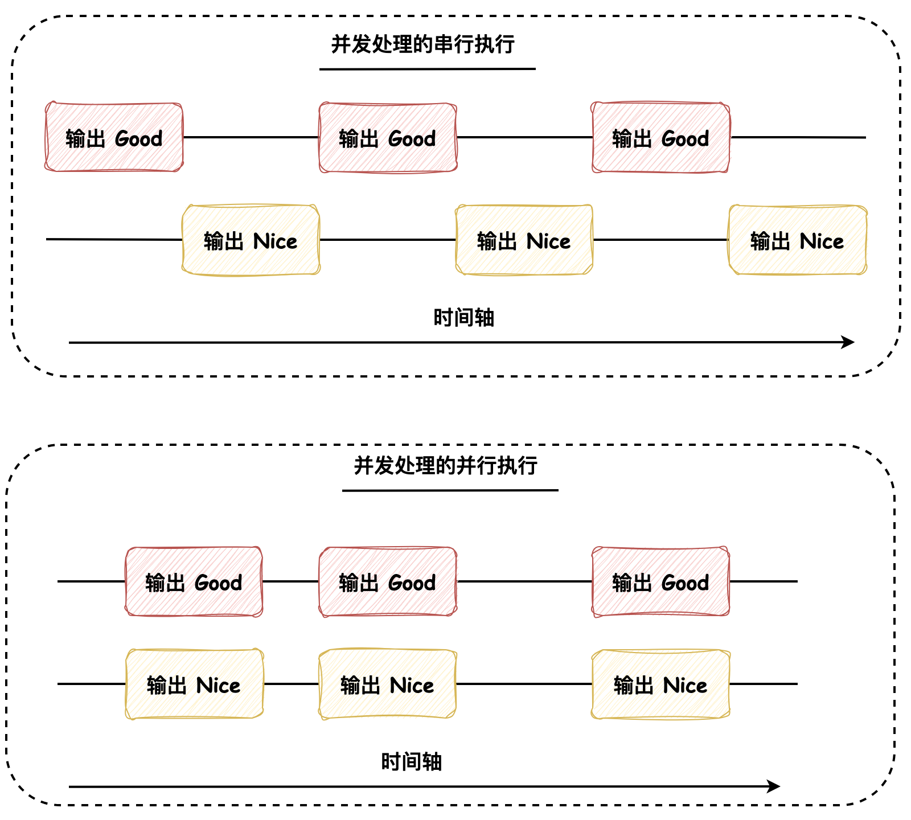

## 《图解Java多线程设计模式》

### 基础知识

#### 串行、并行与并发

- 串行：表示多个操作被 **依次处理**，比如把 10 个操作交给一个人处理时，这个人要一个一个地处理
- 并行：表示多个操作被 **同时处理**，比如把 10 个操作交给 10 个人处理，每个人处理一个操作
- 并发：相对于串行和和并行比较抽象，它用于表示“将一个操作分割成多个部分并且允许无序处理”。比如将 6 个操作分成相对独立的两类，这样便能够开始并发处理了，如下图所示为并发处理的串行执行和并行执行：

#### 进程与线程

进程与线程是操作系统中的两个重要概念，**进程是程序的一次执行，是一个独立的运行环境**，而**线程是进程中的一个执行单元，是 CPU 调度的基本单位**。一个进程可以包含多个线程，线程之间共享进程的资源，比如内存空间、文件句柄等。一般情况下，线程的创建和销毁比进程要快，线程之间的切换也比进程要快，因为一般来说进程中管理的上下文信息会多余线程中管理的上下文信息，而进程/线程暂停时要保存执行过程中的上下文信息，再继续执行时需要恢复之前保存的上下文信息，所以一般来说多线程的并发性比多进程要高。

进程与线程的最大的区别就是**内存是否共享**：**进程有独立的内存空间**，一个进程的内存空间不能被其他进程访问，而**线程共享进程的内存空间**（在 Java 中表示为共享实例），一个线程的内存空间可以被其他线程访问。

#### Java 线程状态

Java 线程的状态主要有以下几种：

1. **新建（New）**：线程对象被创建后，就进入了新建状态。如：`Thread t = new Thread()`

2. **就绪（Runnable）**：当调用线程对象的 `start()` 方法（`t.start()`），线程即进入就绪状态。处于就绪状态的线程，只是获取了执行权，但并未被 CPU 选中执行

3. **运行（Running）**：当 CPU 选中就绪状态的线程后，此线程即进入运行状态，开始执行 `run()` 方法中的代码

4. **阻塞（Blocked）**：阻塞状态是线程因为某种原因放弃了 CPU 使用权，也即让出了 CPU，暂时停止运行。直到线程进入就绪状态，才有机会转到运行状态。阻塞的情况分三种：
    - 等待阻塞：运行状态中的线程执行 `wait()` 方法，使线程进入到等待阻塞状态
    - 同步阻塞：线程在获取 `synchronized` 同步锁失败（因为锁被其他线程所占用），它会进入同步阻塞状态
    - 其他阻塞：通过调用线程的 `sleep()` 或 `join()` 或发出了 I/O 请求时，线程会进入到阻塞状态。当 `sleep()` 状态超时、`join()` 等待线程终止或超时、或者 I/O 处理完毕时，线程重新转入就绪状态

5. **死亡（Terminated）**：一个运行状态的线程完成任务或者其他终止条件发生时，该线程切换到终止状态

这些状态对 CPU 的影响主要体现在线程调度上：

- 当线程处于新建、就绪或运行状态时，它是活动的，可以被 CPU 调度执行。在这些状态下，线程会占用 CPU 资源
- 当线程处于阻塞状态时，它是非活动的，不会被 CPU 调度，也不会占用 CPU 资源。线程在此状态下会释放 CPU，让 CPU 可以调度其他线程执行
- 当线程处于死亡状态时，它已经完成生命周期，不会再被 CPU 调度

这种机制允许多个线程在同一颗 CPU 上并发执行。通过将线程置入 **阻塞（Blocked）** 状态，系统可以确保 CPU 资源不会被单个线程独占，从而提高系统的整体性能和响应能力

#### synchronized 关键字

在Java中，synchronized 关键字可以用来给对象和方法加锁，需要注意 synchronized 保护的是什么。当一个线程访问 syncronized 修饰的方法或代码块时，它会自动获取锁，其他线程则必须等待该线程释放锁后才能获取锁来访问被保护的代码段。如果一个对象有两个被 synchronized 标记的不同方法，那么这两个方法共享同一个对象锁。因此，如果一个线程正在执行其中一个 synchronized 方法，其他线程不能同时执行这两个方法中的任何一个，它们必须等待第一个线程释放锁，这是因为 synchronized 关键字在**对象级别**上添加了一个互斥锁（或监视器锁）。当一个线程获取了对象的锁，其他线程无法通过，直到锁被释放。

如果多线程同时执行同一个对象的被 synchronized 修饰的实例方法和静态方法，多线程是不会被阻塞的，因为实例方法和静态方法分别使用的是对象锁和类锁，它们之间是互不干扰的。

- eg: life.fangyuan.juc.common.Synchronized

#### 线程的协作：wait()、notify()、notifyAll()

在 Java 中，线程的协作是通过 `Object` 类的 `wait()`、`notify()` 和 `notifyAll()` 方法实现的。**这三个方法必须在 synchronized 修饰的方法或代码块中调用**，也就是说，调用这些方法的线程必须持有锁，否则会抛出 `IllegalMonitorStateException` 异常

- obj.wait(): 是将当前线程放入 obj 对象的等待队列，同时释放锁，让其他线程可以获取锁并执行
- obj.notify(): 是唤醒 obj 对象的等待队列中的一个线程，如果有多个线程在等待队列中，只会唤醒其中一个
- obj.notifyAll(): 是唤醒 obj 对象的等待队列中的所有线程

与其说这三个方法是针对线程的操作，倒不如说是针对实例的等待队列的操作，**并且是持有哪个对象的锁才能进入哪个对象的等待队列**，当线程进入等待队列而停止执行时，并**不会浪费 Java 虚拟机的执行时间**。而且一般来说，使用 notifyAll() 方法的代码更加健壮，因为 notify() 方法只会唤醒一个线程，如果唤醒的是一个不应该被唤醒的线程，那么这个线程就会一直等待下去，所以我们在编写程序时，也不要编写针对特定线程才能处理的逻辑

- eg: life.fangyuan.juc.common.WaitAndNotify: 通过 wait() 和 notifyAll() 实现线程协作输出 a b

#### 线程的协作：ReentrantLock 和 Condition

- eg: life.fangyuan.juc.common.ReentrantLockExample

#### Thread.sleep()

`Thread.sleep()` 是 Java 中的一个静态方法，它可以使当前正在执行的线程暂停指定的时间。这个方法接收一个参数，表示暂停的时间，单位是 **毫秒**。还有一个重载版本的 `sleep()` 方法，它接收两个参数，一个是毫秒，另一个是纳秒，用于表示更精确的暂停时间。  

`Thread.sleep()` 方法会**使当前线程进入阻塞状态，不会占用 CPU 资源，但是它不会释放锁**，所以如果当前线程持有某个对象的锁，调用了 `sleep()` 方法，其他线程也无法获取这个锁。

需要注意的是，`Thread.sleep()` 方法可能会抛出 `InterruptedException` 异常，这是一个检查异常，所以在调用 `sleep()` 方法时需要处理这个异常，通常是通过 `try-catch` 语句来捕获并处理

- eg: life.fangyuan.juc.common.SleepExample

##### 为什么线程进入阻塞状态后不会占用 CPU 资源？

在 Java 中，线程的阻塞状态是由操作系统来管理的，当线程调用 `sleep()` 方法进入阻塞状态时，线程的状态会被修改为 **阻塞（Blocked）**，这时线程不会执行任何代码，也不会占用 CPU 资源。操作系统会将 CPU 资源分配给其他可运行的线程或进程，这样就可以实现多个线程在同一颗 CPU 上并发执行。当 `sleep()` 方法的指定时间到达后，操作系统会再次将该线程的状态改为 **就绪（Runnable）**，这样线程就有可能再次获得 CPU 资源并执行代码。这种机制允许多个线程在同一颗 CPU 上并发执行，从而提高系统的整体性能和响应能力。

#### Thread.yield()

`Thread.yield()` 方法是一个静态方法，它会让当前线程让出 CPU，但是**不会释放锁**，而是重新进入就绪状态，等待系统重新调度，所以会浪费 Java 虚拟机的执行时间。`Thread.yield()` 方法的作用是让相同优先级的线程有执行的机会，但是不能保证一定会让出 CPU，只是让出 CPU 的可能性增加了，因为这是由操作系统调度的。

#### Thread.interrupt()

`Thread.interrupt()` 方法是一个实例方法，它会中断线程的执行，但是并不会立即停止线程，而是给线程发送一个中断信号，线程可以通过 `isInterrupted()` 方法来判断是否被中断，如果被中断则返回 true，否则返回 false。如果线程处于阻塞状态，比如调用了 `wait()`、`sleep()`、`join()` 方法，那么线程会抛出 `InterruptedException` 异常，这时可以通过捕获异常来处理中断。

- eg: life.fangyuan.juc.GuardedSuspension.Main

#### Thread.join()

`Thread.join()` 是 Java 中的一个实例方法，这个方法的主要作用是让当前执行的线程暂停运行，直到调用 `join()` 方法的线程执行完毕。当你在一个线程实例上调用 `join()` 方法时，当前执行的线程将被阻塞，直到调用 `join()` 的线程实例完成其执行。这个方法常用于在一个线程中等待另一个线程的完成。 

`Thread.join()` 方法有三种形式：

- `void join() throws InterruptedException`：等待这个线程执行完毕
- `void join(long millis) throws InterruptedException`：等待这个线程执行完毕，最多等待 `millis` 毫秒
- `void join(long millis, int nanos) throws InterruptedException`：等待这个线程执行完毕，最多等待 `millis` 毫秒加 `nanos` 纳秒

如果线程在给定的时间内没有结束，那么 `join()` 方法将返回，程序将继续执行。如果没有指定时间，那么 `join()` 方法将一直阻塞，直到线程结束。  

**需要注意的是**：`Thread.join()` 方法可能会抛出 `InterruptedException`。当一个线程已经被 `join`、`sleep` 或 `wait` 方法阻塞，那么如果另一个线程中断（interrupt）了它，那么它将抛出一个 `InterruptedException`。

- eg: life.fangyuan.juc.common.JoinExample

#### Semaphore 信号量

如果某段逻辑限制 N 个线程执行，而我们的线程数又大于 N，那么可以使用 `Semaphore` 信号量来限制线程执行的数量。`Semaphore` 可以控制同时访问的线程个数，通过 acquire() 方法获取一个许可，如果没有许可，线程就会阻塞，直到有可用信号量为止；通过 release() 方法释放一个许可。

- eg: life.fangyuan.juc.common.SemaphoreExample

---

### Single Threaded Execution 模式：能通过这座桥的只有一个人

Single Threaded Execution 模式是一种非常基础的设计模式，它侧重的点是 **执行处理的线程**，目的是确保在同一时刻 **只有一个线程** 执行 **指定的代码块（临界区）**。这种模式在多线程环境下非常有用，因为它可以避免多个线程同时访问共享资源，从而避免数据竞争和数据不一致的问题。

> 该模式的适用场景：当多个线程同时访问共享资源且共享资源的状态会发生变化时

- eg: life.fangyuan.juc.SingleThreadedExecution.Main

在这个例子中，多线程情况下调用 life.fangyuan.juc.SingleThreadedExecution.Gate.pass 方法会出现问题，因为多个线程同时访问共享资源 Gate 且会对它的状态进行修改，导致数据不一致。通过使用 Single Threaded Execution 模式，即在该方法上标记 synchronized 关键字，可以避免这个问题。

在该模式中提到了死锁，避免死锁的解决方法：

1. 锁顺序：所有线程按照相同的顺序来获取锁
2. 减小锁的粒度：比如将原来的多个锁合并成一个锁
3. 锁超时：即尝试获取锁的时候，如果超过一定时间还没有获取到锁，就放弃获取锁
4. 避免锁嵌套：尽量避免在持有锁的时候再去获取锁
5. 死锁检测：通过工具检测死锁，发现死锁后，通过中断线程等方式来解除死锁

### Immutable 模式：想破坏也破坏不了

Immutable 模式是一种非常基础的设计模式，它侧重的点是 **对象的状态**，目的是确保对象的状态在创建之后 **不会发生变化**。这样该对象在多线程环境下访问时不会出现数据竞争和数据不一致的问题，该模式的优点是无需使用 synchronized 关键字，在频繁访问的情况下提高性能。

该如何使用：
1. 将类的字段设置为 private final，并且不提供 setter 方法
2. 如果字段是可变对象，需要确保在构造函数中创建新的对象，而不是直接引用传入的对象，并且该创建的新对象也是不可变的

Java 中使用到 Immutable 模式的类有：String、BigInteger、BigDecimal、基本数据类型的包装类（Integer、Long和Double等）、LocalDate、LocalTime、LocalDateTime 等

- eg: life.fangyuan.juc.Immutable.Person

### Guarded Suspension 模式：等我准备好哦

Guarded Suspension 模式侧重的点是 **等待条件**，目的是确保在 **满足条件** 之后才执行 **指定的代码块**。这种模式在多线程环境下非常有用，因为它可以避免在条件不满足的情况下执行代码，从而避免数据不一致的问题。这个与先前学过的多线程中生产者与消费者问题一致，**等待、业务和唤醒** 是理解这个模式的精髓所在：

- 等待：`while` 循环判断等待条件，满足条件时释放锁进行等待队列（调用 `wait()` 方法），并等待 `notify()/notifyAll()` 方法的调用，这里使用 while 判断是为了避免虚假唤醒，即线程被唤醒后再次判断等待条件是否满足。这种等待的判断机制也被称为 **自旋锁 Spin Lock**
- 业务：业务是指要执行的代码块
- 唤醒：满足业务代码的执行条件，调用 `notify()/notifyAll()` 方法

- eg: life.fangyuan.juc.GuardedSuspension.RequestQueue

### Thread Per Message 模式：这项工作就交给你了

Thread Per Message 模式是为 **每个任务/请求** 分配 **一个独立的线程** 来执行，任务/请求之间不会相互影响，但是也不能保证执行的顺序。这种模式可以提高响应性，缩短延迟时间，但是频繁创建和销毁线程也会带来开销，所以该模式需要配合线程池来使用。

- eg: life.fangyuan.juc.ThreadPerMessage.Main

### Thread Pool 模式：工作没来就一直等，工作来了就立马干

Thread Pool 模式是为了解决 Thread Per Message 模式中 **频繁创建和销毁线程的开销问题**，它通过 **预先创建一定数量的线程** 并将它们保存在一个线程池中，当有任务/请求到来时，就从线程池中取出一个线程来执行，执行完毕后再将线程放回线程池中，实现线程复用。这种模式可以提高吞吐量和响应速度，控制线程容量，减少线程创建和销毁的开销，不过也需要注意一些问题，比如线程池的大小如何设置和线程池的拒绝策略等。

方法的调用被称为 invocation，方法的执行被称为 execution，**Thread Per Message 模式** 和 **Thread Pool 模式** 都能够将方法的 **调用与执行分离**，这也是 Command 模式的思想，Runnable 接口可以看作是 Command 模式中的 Command 角色

- eg: life.fangyuan.juc.WorkerThread.Main

### Future 模式：先给您提货单

Future 模式是为了解决 **调用者** 和 **执行者** 之间的 **耦合** 问题，它通过 **提供一个 Future 接口** 来表示 **未来的结果**。方法的调用者可以将任务交给其他线程去处理，无需阻塞等待方法的执行，这样调用者可以继续执行其他任务，并能通过 `Future` 对象获取到执行结果。这种模式可以提高系统的吞吐量和响应速度，实现方法调用和执行的解耦。

- eg: life.fangyuan.juc.Future.origin.Main